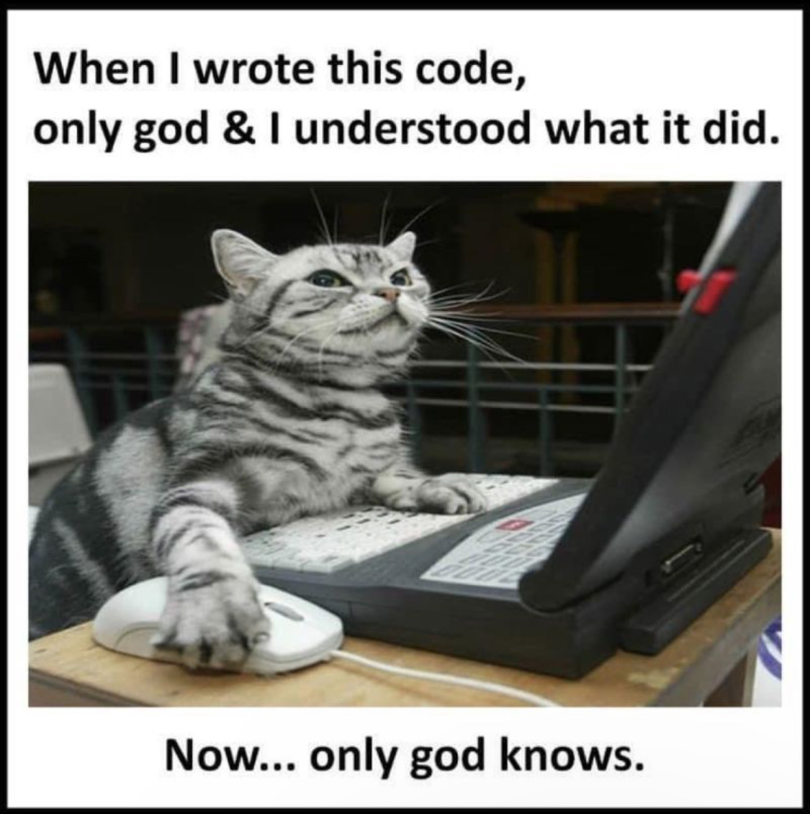

# Writing Code for Humans 🚶
In the vast landscape of software development, it's crucial to remember that code is primarily written for humans to read and secondarily for machines to execute. This lesson explores strategies to enhance code readability and maintainability, ensuring that it communicates its intention clearly not only to the computers but also to human developers.



## It's All Writing
Just as in any form of writing, clarity and precision are vital in code. Writing code should be treated with the same care as writing in a natural language. Consider these principles:

- **Treat English as Just Another Programming Language**: Every function, class, and variable name is an opportunity to explain your code. Use clear and descriptive names that convey purpose and intent.
- **Build Documentation In, Don't Bolt It On**: Good code documents itself through meaningful names and logical structuring. Comments and documentation should be integrated thoughtfully as part of the development process, not added as an afterthought.

## The Role of Comments
Comments in code are crucial, but they should be used wisely. Their primary role is not to describe what the code does—that's the job of the code itself—but to explain why certain decisions were made. Here are a few guidelines:

- **Explain Why, Not What**: Comments should provide insight into the rationale behind certain coding decisions and complex logic that isn't immediately apparent from the code itself.
- **Maintenance Over Time**: Remember, code is read far more often than it is written. Comments can save future developers (including your future self) time and confusion, particularly when dealing with tricky logic or why certain bugs were addressed in a particular way.

## Descriptive Names Over Comments
Whenever possible, use clear and descriptive names that make comments unnecessary. Here are some tips to help your code speak for itself:

- **Descriptive and Clear**: Choose names that reflect the variable's or function's purpose. Avoid generic names like data or info.
- **Avoid Misleading Names**: Names that are misleading can lead to confusion and errors in understanding the code's functionality. Ensure that names accurately reflect what the code element does.
- **Length Matters**: Don't shy away from longer, descriptive names if they help convey meaning more clearly. A longer name that makes a variable's purpose obvious is preferable to a cryptic short one.

## Code Smells and Maintenance
Avoid certain practices that can indicate deeper problems in the code base, known as "code smells":

- **Commented-Out Code**: Never leave commented-out code in your codebase. It can confuse and clutter the code. Instead, rely on version control systems like Git to keep a history of changes. If you need to revisit old versions of code, you can always look up your repository's history.

## Exercise: Refactoring for Readability
Given a piece of complex and poorly documented Ruby code, we'll refactor it to enhance its readability and maintainability.

### Before Refactoring
```ruby
# Bad example: What does this method do?
def process_items(arr)
  first = arr.first
  rest = arr[1..-1]
  rest.select { |item| item > first }
end

# Call the mysterious method
result = process_items([5, 3, 9, 8])
puts result
```

Let's rename the method and variables to reflect their roles more clearly. We'll also add a comment explaining the purpose of the method since its operation isn't obvious from its name and structure.

### After Refactoring
```ruby
# Refactors the input array by filtering elements greater than the first element
def filter_items_greater_than_first(items)
  first_item = items.first
  remaining_items = items[1..-1]
  remaining_items.select { |item| item > first_item }
end

# Call the refactored method
result = filter_items_greater_than_first([5, 3, 9, 8])
puts result.inspect # Expected output: [9, 8]
```

This refactored version makes several improvements:

- **Method and Variable Names**: The method and variable names are more descriptive. `filter_items_greater_than_first` clearly describes what the method does, and `first_item` and `remaining_items` are self-explanatory.
- **Comments**: A comment is added to explain the purpose of the method, which is to filter and return elements greater than the first element of the array. This helps anyone reading the code to quickly understand the method's intent without needing to parse through the code logic.

## Quiz
- What is the main purpose of using descriptive and clear names in your code?
- To make the code look more professional.
  - Not quite. While professional appearance is a bonus, it's not the primary reason for using descriptive names.
- To help the code compile without errors.
  - Incorrect. Descriptive names don't influence the compilation process; they're about readability and maintainability.
- To make the code easier to read and understand for anyone who works with it.
  - Correct! Descriptive names improve the readability of the code, making it easier for others (and future you) to understand and maintain.
- To reduce the need for comments and documentation.
  - Somewhat true, but not the main purpose. Descriptive names can reduce the need for some comments, but they complement rather than replace good documentation.
{: .choose_best #purpose_of_names title="Purpose of Descriptive Names" points="1" answer="3" }

- What should comments in code primarily explain?
- The syntax and grammar of the programming language.
  - Incorrect. Syntax and grammar are fundamental aspects that should be known without requiring comments.
- The logic and algorithms used in the code.
  - Not exactly. While sometimes necessary, comments are better used for explaining the rationale behind the logic.
- The purpose of the code and why certain decisions were made.
  - Correct! Comments are most valuable when they provide context that the code alone cannot, such as why specific decisions were made.
- Detailed descriptions of each line of code.
  - Incorrect. This often clutters the code. Comments should be used sparingly and only when they add significant value.
{: .choose_best #role_of_comments title="Primary Role of Comments" points="1" answer="3" }

- Why should commented-out code be avoided in a codebase?
- It makes the code run slower.
  - Incorrect. Commented-out code doesn't affect runtime, but it can clutter the codebase and confuse other developers.
- It can confuse and clutter the code, making maintenance harder.
  - Correct! Commented-out code can lead to confusion and should be removed or managed through version control.
- It is required by most modern programming languages.
  - Incorrect. No programming language requires commented-out code; it is generally considered a bad practice.
- It helps in debugging and should be kept for future use.
  - Incorrect. While it might seem helpful at the moment, version control systems are a better way to manage code history for debugging.
{: .choose_best #commented_out_code title="Avoiding Commented-Out Code" points="1" answer="2" }

- What does refactoring primarily aim to improve in a poorly documented or complex piece of code?
- The execution speed of the code.
  - Incorrect. Refactoring primarily aims to make code cleaner and more maintainable, not necessarily faster.
- The readability and maintainability of the code.
  - Correct! Refactoring improves the structure and clarity of the code, making it easier to read and maintain.
- The number of lines of code.
  - Incorrect. Reducing lines of code can be a byproduct, but it's not the primary goal of refactoring.
- The programming language used in the code.
  - Incorrect. Refactoring doesn't involve changing the programming language; it involves improving the existing code within the same language.
{: .choose_best #aim_of_refactoring title="Aim of Refactoring" points="1" answer="2" }

- When should documentation be integrated into the development process?
- Only at the end of the project before delivery.
  - Incorrect. Waiting until the end to document can lead to gaps and inaccuracies in the documentation.
- As an afterthought when the code is complete.
  - Incorrect. Documentation should be an integral part of the development process, not an afterthought.
- At the beginning and throughout the development process.
  - Correct! Integrating documentation from the start and maintaining it throughout the project ensures it grows with the code and remains accurate.
- Documentation is not necessary if the code is self-explanatory.
  - Incorrect. Even if code is self-explanatory, documentation is essential for providing context, especially for larger projects or public APIs.
{: .choose_best #documentation_timing title="When to Integrate Documentation" points="1" answer="3" }

```ruby
def calc(d, t)
  t.reduce(0) { |sum, num| sum + num } / d.size
end
```
- What improvements can be made to the code above to enhance its readability?
- Rename calc to calculate_average.
  - Correct. This name clearly describes what the function does.
- Rename d to data and t to totals.
  - Correct. More descriptive variable names make the code easier to understand.
- Add comments to describe what calc, d, and t represent.
  - This would help, but renaming variables and functions is generally more effective for clarity.
- No changes needed; the code is clear as it is.
  - Not quite. The function and variable names are too vague and could be more descriptive.
{: .choose_all #code_clarity_improvement title="Improving Code Clarity" points="2" answer="[1, 2]" }

```ruby
# Updates user status
def update_status(user, status)
  user.status = status
  user.save!
end
```
- Evaluate the effectiveness of the comment in the code snippet above
- The comment is necessary and adds value.
  - Incorrect. The method name update_status already explains what the code does; the comment is redundant.
- The comment should explain why the status needs to be updated, not what the code does.
  - Correct. Comments should provide insights into the 'why' rather than the 'what', which should be clear from the code itself.
- The comment should be removed because it is redundant.
  - Correct. Since the code is self-explanatory, the comment does not add any additional value.
- The method should be commented out for clarity.
  - Incorrect. Commenting out the method would prevent it from being executed and does not improve clarity.
{: .choose_all #comment_usage title="Evaluating Comment Effectiveness" points="1" answer="[2,3]" }

```ruby
def process_transactions(transactions)
  # Temporary fix for bug in transaction processing
  transactions.each { |t| puts t.process }
  # transactions.each { |t| puts t.debug }
end
```
- Identify any code smells in the above snippet and suggest improvements
- The method contains a commented-out line of code.
  - Correct. Commented-out code can lead to confusion and should be removed.
- The comment explains a temporary fix but does not indicate when or why it should be replaced.
  - Correct. Comments about temporary fixes should include information on the conditions or timeline for replacing them.
- The method name process_transactions should be more descriptive.
  - Incorrect. The method name appropriately describes the action being performed.
- No issues; the code follows best practices.
  - Incorrect. The presence of commented-out code and inadequate comments on temporary fixes are issues that need addressing.
{: .choose_all #code_smells title="Identifying Code Smells" points="2" answer="[1, 2]" }

## Conclusion
Writing code for humans is an essential skill in software development. By ensuring that your code is clear, well-documented, and maintainable, you not only make life easier for other developers but also enhance the overall quality and longevity of your software. Embrace these practices to become a better coder, collaborator and teammate.

## Resources
- [Refactoring: Improving the Design of Existing Code by Martin Fowler](https://martinfowler.com/books/refactoring.html)
- [The Art of Readable Code by Dustin Boswell, Trevor Foucher](https://www.oreilly.com/library/view/the-art-of/9781449318482/)
- [The Pragmatic Programmer, 20th Anniversary Edition
your journey to mastery by David Thomas, Andrew Hunt](https://pragprog.com/titles/tpp20/the-pragmatic-programmer-20th-anniversary-edition/)
- [Refactoring Guru](https://refactoring.guru/)
